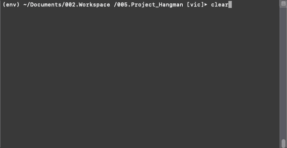

# Project Hangman V0.1.0

This project is a simple Hangman game were the user guess a word in a few amount of attempts.

Use:
* Datamuse API wrapper for python.  

## Getting Started

Click play, and try to guess the words, some definitions will be provided as a hint.

### Description

To generate the random word, we use some "Seed words" these seed words are used in the datamuse wrapper to find similar meaning words.

## Deployment

In the future will be deploy in Heroku.

## Versioning

I will use [SemVer](http://semver.org/) for versioning if i make improvements.  

## Authors

* **Victor Andres Aguirre Fernandez** - *Initial work* - [CubeVic](https://github.com/CubeVic)

## License

This project is licensed under the MIT License - see the [LICENSE.md](LICENSE.md) file for details

